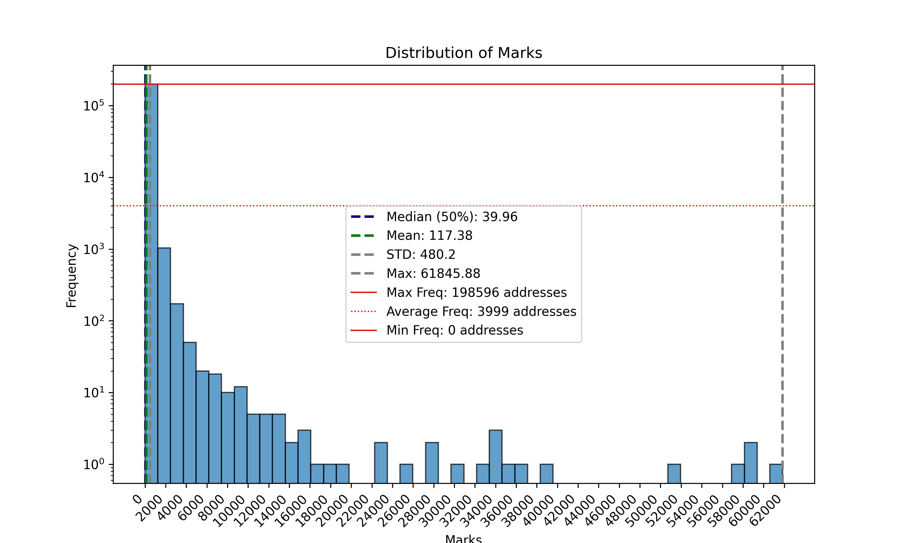
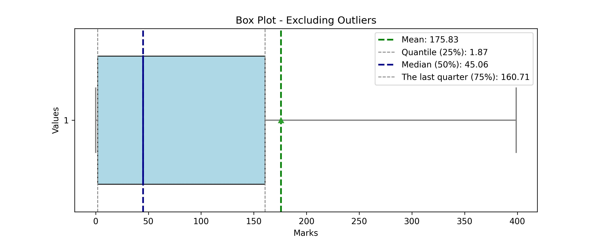

# Scroll Marks Analyzer (SMA)

An automated repository that samples ~50k active addresses from the scroll network every week and aggregates the last four weeks to analyze their corresponding marks and extract insights.

## Scroll at a glance:

* Homepage: [Scroll - native zkEVM L2 for Ethereum](https://scroll.io/)
* Marks landing page: [Session](https://scroll.io/sessions)
* ChainID: [534352 (0x82750)](https://chainlist.org/?search=scroll)
* Official RPC: [Scroll RPC](https://rpc.scroll.io)
* Explorer: [Explorer](https://scrollscan.com)

 

## Descriptive Statistics
 have been analyzed through the latest run.
The average mark score was 
| Statistic | Value |
|-----------|-------|
| count | 199964.0 |
| mean | 190.95022712077701 |
| std | 1833.2635814078278 |
| min | 0.0 |
| 25% | 1.8698986710804273 |
| 50% | 45.43633438422533 |
| 75% | 162.1473717759746 |
| max | 217040.21169570487 |

 

## Marks Analysis
### Ranks and Leaderboard
| Rank | Category | Average Marks |
|------|----------|---------------|
| 179965 - 199960 | Top 100% | 0.1050940148 |
| 159969 - 179964 | Top 90% | 0.6079030157 |
| 139973 - 159968 | Top 80% | 1.9846053172 |
| 119977 - 139972 | Top 70% | 7.3886952552 |
| 099981 - 119976 | Top 60% | 27.2705555215 |
| 079985 - 099980 | Top 50% | 63.8898389596 |
| 059989 - 079984 | Top 40% | 106.4812510348 |
| 039993 - 059988 | Top 30% | 163.3520147110 |
| 019997 - 039992 | Top 20% | 264.3173056776 |
| 000001 - 019996 | Top 10% | 2651.4535013192 |

### Histogram (Frequency table)

| Marks | Frequency | Freq. Portion |
|-------|-----------|---------------|
| 4340.8042339140975 | 199370 | 99.70294653037547 |
| 8681.608467828195 | 316 | 0.15802844512012162 |
| 13022.412701742292 | 122 | 0.061010981976755814 |
| 17363.21693565639 | 43 | 0.02150387069672541 |
| 21704.021169570486 | 27 | 0.013502430437478747 |
| 26044.825403484585 | 17 | 0.008501530275449582 |
| 30385.629637398684 | 5 | 0.0025004500810145826 |
| 34726.43387131278 | 9 | 0.004500810145826249 |
| 39067.238105226876 | 6 | 0.003000540097217499 |
| 43408.04233914097 | 3 | 0.0015002700486087496 |
| 47748.846573055074 | 1 | 0.0005000900162029165 |
| 52089.65080696917 | 5 | 0.0025004500810145826 |
| 56430.455040883266 | 3 | 0.0015002700486087496 |
| 60771.25927479737 | 3 | 0.0015002700486087496 |
| 65112.063508711464 | 3 | 0.0015002700486087496 |
| 69452.86774262556 | 1 | 0.0005000900162029165 |
| 73793.67197653966 | 1 | 0.0005000900162029165 |
| 78134.47621045375 | 0 | 0.0 |
| 82475.28044436785 | 5 | 0.0025004500810145826 |
| 86816.08467828194 | 0 | 0.0 |
| 91156.88891219605 | 2 | 0.001000180032405833 |
| 95497.69314611015 | 1 | 0.0005000900162029165 |
| 99838.49738002424 | 3 | 0.0015002700486087496 |
| 104179.30161393834 | 2 | 0.001000180032405833 |
| 108520.10584785244 | 1 | 0.0005000900162029165 |
| 112860.91008176653 | 1 | 0.0005000900162029165 |
| 117201.71431568063 | 0 | 0.0 |
| 121542.51854959474 | 1 | 0.0005000900162029165 |
| 125883.32278350883 | 0 | 0.0 |
| 130224.12701742293 | 2 | 0.001000180032405833 |
| 134564.93125133702 | 1 | 0.0005000900162029165 |
| 138905.73548525112 | 1 | 0.0005000900162029165 |
| 143246.53971916522 | 0 | 0.0 |
| 147587.3439530793 | 1 | 0.0005000900162029165 |
| 151928.1481869934 | 0 | 0.0 |
| 156268.9524209075 | 0 | 0.0 |
| 160609.7566548216 | 1 | 0.0005000900162029165 |
| 164950.5608887357 | 1 | 0.0005000900162029165 |
| 169291.3651226498 | 0 | 0.0 |
| 173632.16935656389 | 1 | 0.0005000900162029165 |
| 177972.973590478 | 1 | 0.0005000900162029165 |
| 182313.7778243921 | 0 | 0.0 |
| 186654.5820583062 | 0 | 0.0 |
| 190995.3862922203 | 0 | 0.0 |
| 195336.1905261344 | 0 | 0.0 |
| 199676.9947600485 | 0 | 0.0 |
| 204017.79899396258 | 1 | 0.0005000900162029165 |
| 208358.60322787668 | 1 | 0.0005000900162029165 |
| 212699.40746179078 | 1 | 0.0005000900162029165 |
| 217040.21169570487 | 1 | 0.0005000900162029165 |

 

## Useful insights from users
| Date | All TX Fee | Cumulative New Users | Returning Users | Total Active Users | Total New Users | TXs |
|------|------------|----------------------|-----------------|--------------------|-----------------|-----|
| 2024-10-01 00:00:00.000 UTC | 33.57346557783894 | 2486364 | 192981 | 198013 | 5032 | 1425360 |
| 2024-09-01 00:00:00.000 UTC | 193.88191450864377 | 2481332 | 811724 | 857700 | 45976 | 8778952 |
| 2024-08-01 00:00:00.000 UTC | 179.34732783967948 | 2435356 | 657773 | 701064 | 43291 | 8644875 |
| 2024-07-01 00:00:00.000 UTC | 381.58224175301444 | 2392065 | 920328 | 993276 | 72948 | 10253423 |
| 2024-06-01 00:00:00.000 UTC | 403.6076246096607 | 2319117 | 918781 | 1062545 | 143764 | 9628384 |
| 2024-05-01 00:00:00.000 UTC | 680.1605652626372 | 2175353 | 928769 | 1100032 | 171263 | 10995938 |
| 2024-04-01 00:00:00.000 UTC | 1959.7161085410223 | 2004090 | 925041 | 1093653 | 168612 | 8821687 |
| 2024-03-01 00:00:00.000 UTC | 3521.8848544871485 | 1835478 | 848631 | 1042312 | 193681 | 10061465 |
| 2024-02-01 00:00:00.000 UTC | 2296.4530213818025 | 1641797 | 552192 | 813943 | 261751 | 7176974 |
| 2024-01-01 00:00:00.000 UTC | 1037.25106765445 | 1380046 | 543934 | 635997 | 92063 | 4857519 |
| 2023-12-01 00:00:00.000 UTC | 1674.090754365718 | 1287983 | 697468 | 904898 | 207430 | 4337003 |
| 2023-11-01 00:00:00.000 UTC | 1311.8132849968154 | 1080553 | 146557 | 958425 | 811868 | 4189842 |
| 2023-10-01 00:00:00.000 UTC | 420.08955209124406 | 268685 | 0 | 268685 | 268685 | 1798417 |

 

## Contracts-Users overlap

### Overlapped data
| Days Category | 01 contract | 02 contracts | 03-05 contracts | 06-10 contracts | 11-20 contracts | 21-50 contracts | 51-100 contracts | Over 100 contracts | Sum   |
|---------------|-------------|--------------|-----------------|-----------------|-----------------|-----------------|------------------|--------------------|-------|
| Over 100 days | 182 | 70 | 157 | 390 | 822 | 3200 | 5632 | 4013 | 14466 |
| 51-100 days | 362 | 173 | 1187 | 1499 | 3747 | 14596 | 14547 | 3247 | 39358 |
| 21-50 days | 1198 | 943 | 3544 | 16998 | 52172 | 104632 | 24245 | 1579 | 205311 |
| 11-20 days | 1650 | 2164 | 15475 | 62725 | 198079 | 144204 | 6913 | 95 | 431305 |
| 06-10 days | 5759 | 10344 | 86656 | 189803 | 175024 | 51013 | 1558 | 20 | 520177 |
| 03-5 days | 46202 | 95005 | 209950 | 122134 | 48072 | 7773 | 172 | 0 | 529308 |
| 02 days | 156104 | 62623 | 58388 | 18948 | 4479 | 818 | 32 | 0 | 301392 |
| 01 day | 116969 | 41857 | 24318 | 9360 | 1975 | 369 | 12 | 13 | 194873 |

### Contracts usage
| Contracts          | Count   |
|--------------------|---------|
| 01 contract | 328426 |
| 02 contracts | 213179 |
| 03-05 contracts | 399675 |
| 06-10 contracts | 421857 |
| 11-20 contracts | 484370 |
| 21-50 contracts | 326605 |
| 51-100 contracts | 53111 |
| Over 100 contracts | 8967 |

 

---
Hope you enjoy it!
Made with ❤️ Powered by Flipside, Dune, and Zerion!

