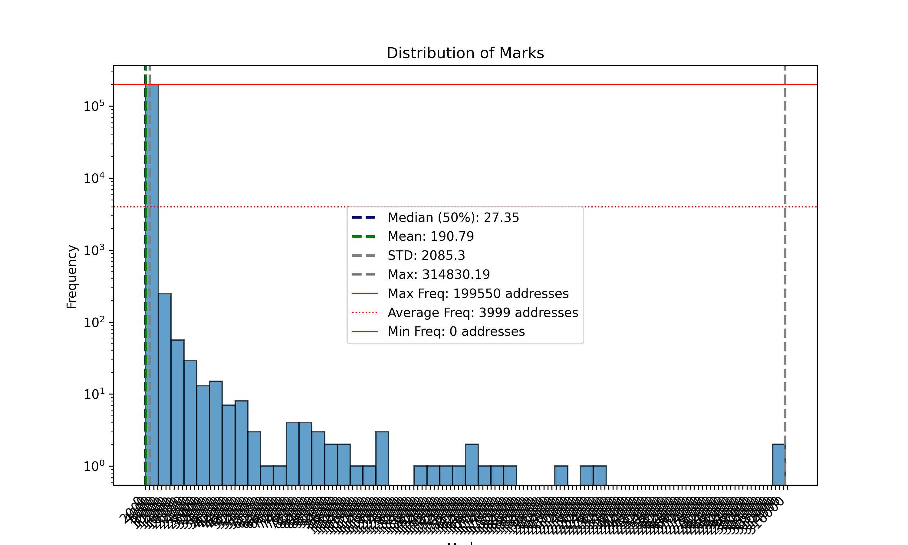

# Scroll Marks Analyzer (SMA)

An automated repository that samples ~50k active addresses from the scroll network every week and aggregates the last four weeks to analyze their corresponding marks and extract insights.

## Scroll at a glance:

* Homepage: [Scroll - native zkEVM L2 for Ethereum](https://scroll.io/)
* Marks landing page: [Session](https://scroll.io/sessions)
* ChainID: [534352 (0x82750)](https://chainlist.org/?search=scroll)
* Official RPC: [Scroll RPC](https://rpc.scroll.io)
* Explorer: [Explorer](https://scrollscan.com)

 

## Descriptive Statistics
 have been analyzed through the latest run.
The average mark score was 
| Statistic | Value |
|-----------|-------|
| count | 199899.0 |
| mean | 107.93606307351135 |
| std | 219.47412162102165 |
| min | 0.0 |
| 25% | 1.1956776699328957 |
| 50% | 42.4936028422984 |
| 75% | 137.38448922256512 |
| max | 8233.978030063483 |

 

## Marks Analysis
### Ranks and Leaderboard
| Rank | Category | Average Marks |
|------|----------|---------------|
| 179902 - 199890 | Top 100% | 0.1141289923 |
| 159913 - 179901 | Top 90% | 0.4735933257 |
| 139924 - 159912 | Top 80% | 1.2456171238 |
| 119935 - 139923 | Top 70% | 3.7854955445 |
| 099946 - 119934 | Top 60% | 18.9595300683 |
| 079957 - 099945 | Top 50% | 57.5700408152 |
| 059968 - 079956 | Top 40% | 91.8629878524 |
| 039979 - 059967 | Top 30% | 138.0547022553 |
| 019990 - 039978 | Top 20% | 212.9120945168 |
| 000001 - 019989 | Top 10% | 870.2013200046 |

### Histogram (Frequency table)

| Marks | Frequency | Freq. Portion |
|-------|-----------|---------------|
| 164.67956060126966 | 158951 | 79.51565540598003 |
| 329.3591212025393 | 26074 | 13.043587011440778 |
| 494.03868180380897 | 7819 | 3.911475295023987 |
| 658.7182424050786 | 3042 | 1.52176849308901 |
| 823.3978030063483 | 1439 | 0.719863531083197 |
| 988.0773636076179 | 790 | 0.3951995757857718 |
| 1152.7569242088875 | 484 | 0.24212227174723236 |
| 1317.4364848101573 | 336 | 0.16808488286584725 |
| 1482.116045411427 | 235 | 0.1175593674805777 |
| 1646.7956060126967 | 167 | 0.0835421888053467 |
| 1811.4751666139662 | 151 | 0.07553814676411588 |
| 1976.1547272152359 | 77 | 0.038519452323423325 |
| 2140.8342878165054 | 49 | 0.024512378751269392 |
| 2305.513848417775 | 55 | 0.02751389451673095 |
| 2470.193409019045 | 44 | 0.02201111561338476 |
| 2634.8729696203145 | 30 | 0.015007578827307792 |
| 2799.552530221584 | 22 | 0.01100555780669238 |
| 2964.232090822854 | 24 | 0.012006063061846232 |
| 3128.9116514241236 | 12 | 0.006003031530923116 |
| 3293.5912120253934 | 13 | 0.006503284158500043 |
| 3458.2707726266626 | 11 | 0.00550277890334619 |
| 3622.9503332279323 | 10 | 0.0050025262757692635 |
| 3787.629893829202 | 6 | 0.003001515765461558 |
| 3952.3094544304718 | 10 | 0.0050025262757692635 |
| 4116.9890150317415 | 4 | 0.002001010510307705 |
| 4281.668575633011 | 6 | 0.003001515765461558 |
| 4446.348136234281 | 3 | 0.001500757882730779 |
| 4611.02769683555 | 3 | 0.001500757882730779 |
| 4775.70725743682 | 2 | 0.0010005052551538525 |
| 4940.38681803809 | 1 | 0.0005002526275769263 |
| 5105.06637863936 | 2 | 0.0010005052551538525 |
| 5269.745939240629 | 1 | 0.0005002526275769263 |
| 5434.425499841898 | 2 | 0.0010005052551538525 |
| 5599.105060443168 | 1 | 0.0005002526275769263 |
| 5763.784621044438 | 3 | 0.001500757882730779 |
| 5928.464181645708 | 0 | 0.0 |
| 6093.143742246977 | 1 | 0.0005002526275769263 |
| 6257.823302848247 | 1 | 0.0005002526275769263 |
| 6422.502863449517 | 0 | 0.0 |
| 6587.182424050787 | 2 | 0.0010005052551538525 |
| 6751.861984652056 | 3 | 0.001500757882730779 |
| 6916.541545253325 | 5 | 0.0025012631378846318 |
| 7081.221105854595 | 1 | 0.0005002526275769263 |
| 7245.900666455865 | 1 | 0.0005002526275769263 |
| 7410.580227057135 | 1 | 0.0005002526275769263 |
| 7575.259787658404 | 0 | 0.0 |
| 7739.939348259674 | 0 | 0.0 |
| 7904.6189088609435 | 2 | 0.0010005052551538525 |
| 8069.298469462213 | 1 | 0.0005002526275769263 |
| 8233.978030063483 | 2 | 0.0010005052551538525 |

 

## Useful insights from users
| Date | All TX Fee | Cumulative New Users | Returning Users | Total Active Users | Total New Users | TXs |
|------|------------|----------------------|-----------------|--------------------|-----------------|-----|
| 2024-07-01 00:00:00.000 UTC | 43.1500199127761 | 2328910 | 206965 | 216758 | 9793 | 966653 |
| 2024-06-01 00:00:00.000 UTC | 403.6076246096606 | 2319117 | 918781 | 1062545 | 143764 | 9628384 |
| 2024-05-01 00:00:00.000 UTC | 680.160565262639 | 2175353 | 928769 | 1100032 | 171263 | 10995938 |
| 2024-04-01 00:00:00.000 UTC | 1959.716108541023 | 2004090 | 925041 | 1093653 | 168612 | 8821687 |
| 2024-03-01 00:00:00.000 UTC | 3521.884854487156 | 1835478 | 848631 | 1042312 | 193681 | 10061465 |
| 2024-02-01 00:00:00.000 UTC | 2296.4530213818016 | 1641797 | 552192 | 813943 | 261751 | 7176974 |
| 2024-01-01 00:00:00.000 UTC | 1037.251067654454 | 1380046 | 543934 | 635997 | 92063 | 4857519 |
| 2023-12-01 00:00:00.000 UTC | 1674.0907543657065 | 1287983 | 697468 | 904898 | 207430 | 4337003 |
| 2023-11-01 00:00:00.000 UTC | 1311.8132849968154 | 1080553 | 146557 | 958425 | 811868 | 4189842 |
| 2023-10-01 00:00:00.000 UTC | 420.0895520912449 | 268685 | 0 | 268685 | 268685 | 1798417 |

 

## Contracts-Users overlap

### Overlapped data
| Days Category | 01 contract | 02 contracts | 03-05 contracts | 06-10 contracts | 11-20 contracts | 21-50 contracts | 51-100 contracts | Over 100 contracts | Sum   |
|---------------|-------------|--------------|-----------------|-----------------|-----------------|-----------------|------------------|--------------------|-------|
| Over 100 days | 55 | 43 | 73 | 187 | 365 | 1543 | 1546 | 351 | 4163 |
| 51-100 days | 186 | 70 | 757 | 1243 | 2879 | 11252 | 5109 | 535 | 22031 |
| 21-50 days | 950 | 968 | 3915 | 14654 | 44408 | 62339 | 5565 | 156 | 132955 |
| 11-20 days | 1631 | 2560 | 15873 | 74549 | 158878 | 58625 | 1786 | 41 | 313943 |
| 06-10 days | 5510 | 10280 | 91906 | 213547 | 159904 | 24108 | 817 | 0 | 506072 |
| 03-5 days | 49917 | 98953 | 221994 | 150160 | 53353 | 5112 | 217 | 0 | 579706 |
| 02 days | 191506 | 69391 | 56293 | 27637 | 7637 | 704 | 26 | 0 | 353194 |
| 01 day | 117073 | 30990 | 33352 | 13670 | 3274 | 372 | 13 | 13 | 198757 |

### Contracts usage
| Contracts          | Count   |
|--------------------|---------|
| 01 contract | 366828 |
| 02 contracts | 213255 |
| 03-05 contracts | 424163 |
| 06-10 contracts | 495647 |
| 11-20 contracts | 430698 |
| 21-50 contracts | 164055 |
| 51-100 contracts | 15079 |
| Over 100 contracts | 1096 |

 

---
Hope you enjoy it!
Made with ❤️ Powered by Flipside, Dune, and Zerion!

