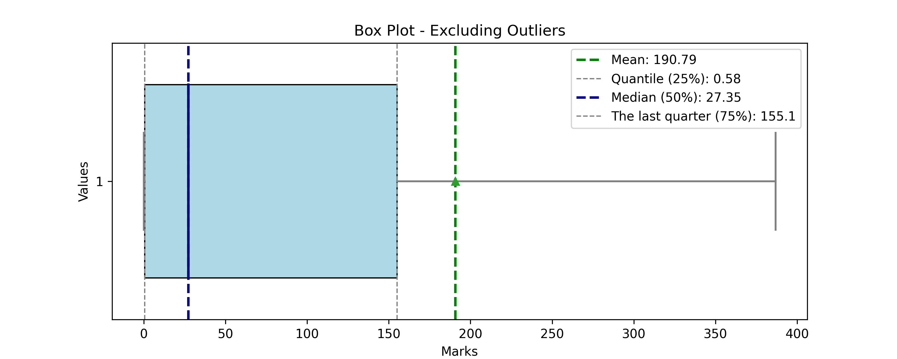

# Scroll Marks Analyzer (SMA)

An automated repository that samples ~50k active addresses from the scroll network every week and aggregates the last four weeks to analyze their corresponding marks and extract insights.

## Scroll at a glance:

* Homepage: [Scroll - native zkEVM L2 for Ethereum](https://scroll.io/)
* Marks landing page: [Session](https://scroll.io/sessions)
* ChainID: [534352 (0x82750)](https://chainlist.org/?search=scroll)
* Official RPC: [Scroll RPC](https://rpc.scroll.io)
* Explorer: [Explorer](https://scrollscan.com)

 

## Descriptive Statistics
 have been analyzed through the latest run.
The average mark score was 
| Statistic | Value |
|-----------|-------|
| count | 199964.0 |
| mean | 198.6919411825931 |
| std | 1654.2925270167186 |
| min | 0.0 |
| 25% | 1.1088070571422577 |
| 50% | 41.272247314453125 |
| 75% | 167.9013557434082 |
| max | 152657.25 |

 

## Marks Analysis
### Ranks and Leaderboard
| Rank | Category | Average Marks |
|------|----------|---------------|
| 179965 - 199960 | Top 100% | 0.0048344311 |
| 159969 - 179964 | Top 90% | 0.2776102232 |
| 139973 - 159968 | Top 80% | 1.1857319492 |
| 119977 - 139972 | Top 70% | 4.9428423013 |
| 099981 - 119976 | Top 60% | 23.7648142743 |
| 079985 - 099980 | Top 50% | 59.9887975588 |
| 059989 - 079984 | Top 40% | 107.0137439829 |
| 039993 - 059988 | Top 30% | 169.4227020659 |
| 019997 - 039992 | Top 20% | 277.8761041668 |
| 000001 - 019996 | Top 10% | 2904.2865766466 |

### Histogram (Frequency table)

| Marks | Frequency | Freq. Portion |
|-------|-----------|---------------|
| 3053.145 | 198975 | 99.50541097397532 |
| 6106.29 | 552 | 0.27604968894400994 |
| 9159.435 | 148 | 0.07401332239803164 |
| 12212.58 | 86 | 0.04300774139345082 |
| 15265.725 | 39 | 0.019503510631913745 |
| 18318.87 | 24 | 0.012002160388869997 |
| 21372.015 | 25 | 0.012502250405072912 |
| 24425.16 | 16 | 0.008001440259246664 |
| 27478.305 | 11 | 0.005500990178232082 |
| 30531.45 | 7 | 0.0035006301134204157 |
| 33584.595 | 8 | 0.004000720129623332 |
| 36637.74 | 7 | 0.0035006301134204157 |
| 39690.885 | 4 | 0.002000360064811666 |
| 42744.03 | 4 | 0.002000360064811666 |
| 45797.175 | 5 | 0.0025004500810145826 |
| 48850.32 | 3 | 0.0015002700486087496 |
| 51903.465 | 3 | 0.0015002700486087496 |
| 54956.61 | 2 | 0.001000180032405833 |
| 58009.755 | 4 | 0.002000360064811666 |
| 61062.9 | 2 | 0.001000180032405833 |
| 64116.045 | 0 | 0.0 |
| 67169.19 | 3 | 0.0015002700486087496 |
| 70222.335 | 2 | 0.001000180032405833 |
| 73275.48 | 3 | 0.0015002700486087496 |
| 76328.625 | 1 | 0.0005000900162029165 |
| 79381.77 | 3 | 0.0015002700486087496 |
| 82434.915 | 3 | 0.0015002700486087496 |
| 85488.06 | 1 | 0.0005000900162029165 |
| 88541.205 | 1 | 0.0005000900162029165 |
| 91594.35 | 4 | 0.002000360064811666 |
| 94647.495 | 2 | 0.001000180032405833 |
| 97700.64 | 1 | 0.0005000900162029165 |
| 100753.785 | 2 | 0.001000180032405833 |
| 103806.93 | 0 | 0.0 |
| 106860.075 | 3 | 0.0015002700486087496 |
| 109913.22 | 0 | 0.0 |
| 112966.365 | 1 | 0.0005000900162029165 |
| 116019.51 | 0 | 0.0 |
| 119072.655 | 1 | 0.0005000900162029165 |
| 122125.8 | 0 | 0.0 |
| 125178.94499999999 | 2 | 0.001000180032405833 |
| 128232.09 | 1 | 0.0005000900162029165 |
| 131285.235 | 1 | 0.0005000900162029165 |
| 134338.38 | 0 | 0.0 |
| 137391.525 | 0 | 0.0 |
| 140444.67 | 0 | 0.0 |
| 143497.815 | 1 | 0.0005000900162029165 |
| 146550.96 | 1 | 0.0005000900162029165 |
| 149604.105 | 1 | 0.0005000900162029165 |
| 152657.25 | 1 | 0.0005000900162029165 |

 

## Useful insights from users
| Date | All TX Fee | Cumulative New Users | Returning Users | Total Active Users | Total New Users | TXs |
|------|------------|----------------------|-----------------|--------------------|-----------------|-----|
| 2024-12-01 00:00:00.000 UTC | 25.226930930449644 | 2732786 | 180371 | 210912 | 30541 | 1113465 |
| 2024-11-01 00:00:00.000 UTC | 69.57261167014143 | 2702245 | 466049 | 536046 | 69997 | 3006383 |
| 2024-10-01 00:00:00.000 UTC | 279.49942964284173 | 2632248 | 1027963 | 1178879 | 150916 | 13238685 |
| 2024-09-01 00:00:00.000 UTC | 193.8819145086438 | 2481332 | 811724 | 857700 | 45976 | 8778952 |
| 2024-08-01 00:00:00.000 UTC | 179.34732783967942 | 2435356 | 657773 | 701064 | 43291 | 8644875 |
| 2024-07-01 00:00:00.000 UTC | 381.58224175301433 | 2392065 | 920328 | 993276 | 72948 | 10253423 |
| 2024-06-01 00:00:00.000 UTC | 403.60762460966066 | 2319117 | 918781 | 1062545 | 143764 | 9628384 |
| 2024-05-01 00:00:00.000 UTC | 680.1605652626369 | 2175353 | 928769 | 1100032 | 171263 | 10995938 |
| 2024-04-01 00:00:00.000 UTC | 1959.7161085410219 | 2004090 | 925041 | 1093653 | 168612 | 8821687 |
| 2024-03-01 00:00:00.000 UTC | 3521.8848544871475 | 1835478 | 848631 | 1042312 | 193681 | 10061465 |
| 2024-02-01 00:00:00.000 UTC | 2296.4530213818025 | 1641797 | 552192 | 813943 | 261751 | 7176974 |
| 2024-01-01 00:00:00.000 UTC | 1037.25106765445 | 1380046 | 543934 | 635997 | 92063 | 4857519 |
| 2023-12-01 00:00:00.000 UTC | 1674.0907543657172 | 1287983 | 697468 | 904898 | 207430 | 4337003 |
| 2023-11-01 00:00:00.000 UTC | 1311.8132849968156 | 1080553 | 146557 | 958425 | 811868 | 4189842 |
| 2023-10-01 00:00:00.000 UTC | 420.089552091244 | 268685 | 0 | 268685 | 268685 | 1798417 |

 

## Contracts-Users overlap

### Overlapped data
| Days Category | 01 contract | 02 contracts | 03-05 contracts | 06-10 contracts | 11-20 contracts | 21-50 contracts | 51-100 contracts | Over 100 contracts | Sum   |
|---------------|-------------|--------------|-----------------|-----------------|-----------------|-----------------|------------------|--------------------|-------|
| Over 100 days | 285 | 90 | 249 | 434 | 971 | 3544 | 6840 | 6242 | 18655 |
| 51-100 days | 280 | 209 | 923 | 1555 | 4570 | 14546 | 19457 | 4954 | 46494 |
| 21-50 days | 1326 | 1084 | 3521 | 13968 | 60967 | 146646 | 38329 | 2278 | 268119 |
| 11-20 days | 2698 | 4555 | 13503 | 60115 | 206804 | 187921 | 10402 | 159 | 486157 |
| 06-10 days | 9929 | 11084 | 91992 | 181043 | 160281 | 49223 | 1459 | 16 | 505027 |
| 03-5 days | 62895 | 97006 | 206418 | 108068 | 38453 | 6914 | 154 | 0 | 519908 |
| 02 days | 161531 | 60059 | 46862 | 15116 | 3355 | 548 | 13 | 0 | 287484 |
| 01 day | 248996 | 36719 | 18789 | 6044 | 1231 | 257 | 9 | 13 | 312058 |

### Contracts usage
| Contracts          | Count   |
|--------------------|---------|
| 01 contract | 487940 |
| 02 contracts | 210806 |
| 03-05 contracts | 382257 |
| 06-10 contracts | 386343 |
| 11-20 contracts | 476632 |
| 21-50 contracts | 409599 |
| 51-100 contracts | 76663 |
| Over 100 contracts | 13662 |

 

---
Hope you enjoy it!
Made with ❤️ Powered by Flipside, Dune, and Zerion!

